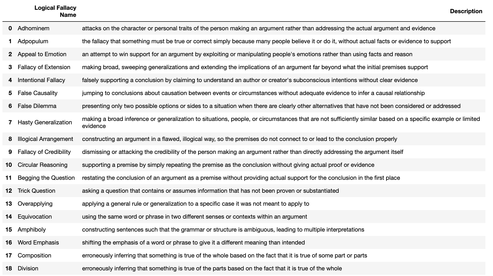

# logical-fallacy-news-chain
Returns any logical fallacies in a news article and any related news articles for better perspective on the story.

Logical fallacies are flawed reasoning or false arguments that can undermine the validity of a news source. Examples include circular reasoning, false
dichotomies, ad hominem attacks, etc.  News Stories online are optimized to perform well on specific metrics like clicks or time spent, however optimizing for metrics alone does not guarantee logically sound reasoning.

Comparing news articles specifically for logical flaws requires reconciliation of reasoning about arguments rather than a headline or image that sounds appealing. 

Overall, allowing logical flaws to persist makes news stories less safe and ethical. Eliminating fallacies ensures news sources remain logically valid and aligned with human reasoning. This maintains user trust, mitigates risks, and could lead to greater reader retention.

List of logical fallacies below (there are 19 from this scholastic paper that reconciled new categories of logical fallacies since Aristotle's identification of 13).
https://arxiv.org/pdf/2212.07425.pdf

For this app to run, you'll need API keys from OpenAI (get it [here](https://platform.openai.com/account/api-keys)) and Serper (get it [here](https://serper.dev/api-key)).

